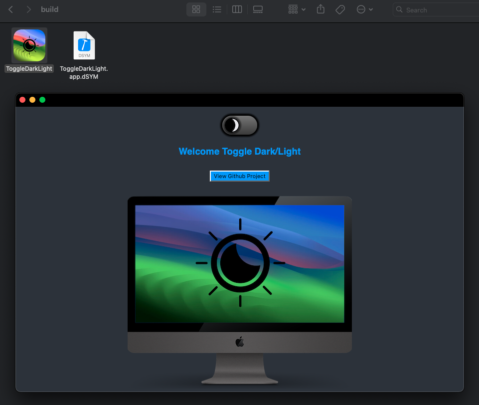

# Toggle Dark/Light
- I'm not a web expert or HTML Coder but I have a lot of fun doing stuff like that.

Simple html page for toggle Dark/Light ➣ [Demo](https://chris1111.github.io/Toggle-Dark-Light/)

Download Release App ➣ [ToggleDarkLight.app.zip](https://github.com/chris1111/Toggle-Dark-Light/releases/tag/V2)

Build by: [chris1111](https://github.com/chris1111/)
App Created from: [MacGap](https://macgapproject.github.io/)

#### Build on macOS
- Prerequisite: Xcode installed

- [x] `Build`
```bash
git clone https://github.com/chris1111/Toggle-Dark-Light.git
cd $HOME/Toggle-Dark-Light
make
```

- [Result ⇩] ` in build folder`

